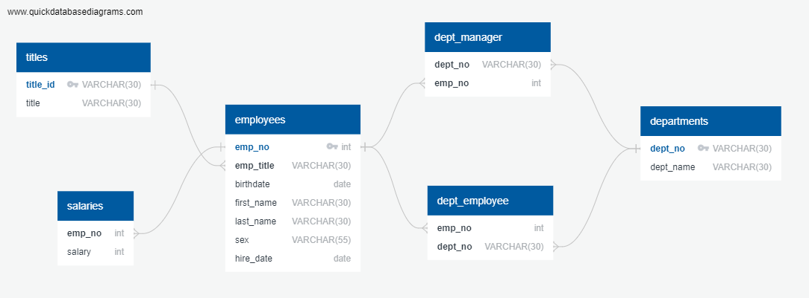

# sql_challange

# Homework - Employee Database: A Mystery in Two Parts

## [PART 1] - Solution - QuickDBD

- Includes QuickDBD image (.png) and .sql file

## [PART 2] - Solution - Data Analysis

- PostgreSQL Code provided in two forms, .sql and

- Saved and Uploaded CSV of the Tables that were manipulated

